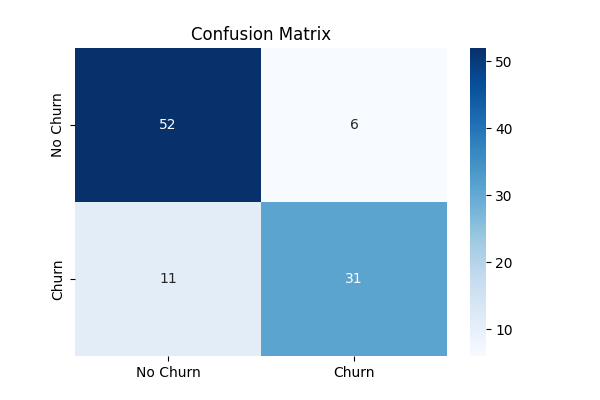
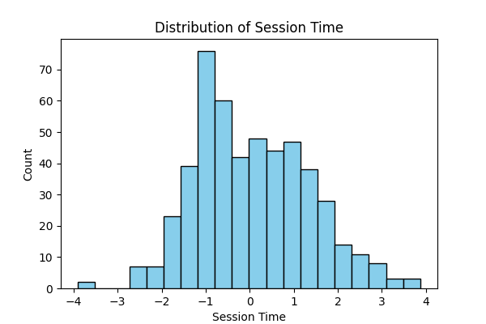

# User Behavior Analytics Pipeline

## Overview
This project simulates a **user behavior analytics pipeline** with synthetic data.  
It demonstrates a complete machine learning workflow: data generation, model training, evaluation, and visualization.

**Features:**
- Automatically generates a synthetic dataset of user behavior.
- Trains a logistic regression model to predict churn.
- Evaluates performance using accuracy and classification report.
- Saves visualizations: confusion matrix and feature histograms.

---

## Folder Structure

```
user_behavior_pipeline/
├─ data/                  # Contains dataset
│  └─ user_behavior.csv   # Automatically generated
├─ output/                # Contains plots and reports
│  ├─ classification_report.txt
│  ├─ confusion_matrix.png
│  └─ user_behavior_hist.png
├─ src/                   # Source code
│  ├─ churn_model.py      # Main pipeline
│  └─ generate_data.py    # Generates synthetic dataset
├─ requirements.txt       # Python dependencies
└─ README.md              # Project description and instructions
```

---

## Setup

1. **Clone or download the project**:

```bash
git clone <https://github.com/AfuaX/user_behavior_pipeline>
cd user_behavior_pipeline
```

2. **Create and activate a Python virtual environment**:

**Windows:**
```bash
python -m venv venv
.\venv\Scripts\activate
```

**macOS / Linux:**
```bash
python3 -m venv venv
source venv/bin/activate
```

3. **Install dependencies**:
```bash
pip install -r requirements.txt
```

---

## Running the Project

### Generate the dataset:
```bash
python src/generate_data.py
```
This will create `data/user_behavior.csv` automatically.

### Run the main pipeline:
```bash
python src/churn_model.py
```

The script will:
- Load the dataset  
- Perform train/test split  
- Train a logistic regression model  
- Evaluate model and save classification report  
- Generate plots: confusion matrix & feature histogram  

## Outputs

[📄 View classification report](docs/classification_report.txt)






```

---

## Notes
- The project is fully self-contained; no external dataset is required.  
- You can modify `generate_data.py` to create more samples or add new features.  
- Plots and reports are saved automatically in the `output/` folder.  

---

## Dependencies
- pandas  
- scikit-learn  
- matplotlib  
- seaborn  

---
